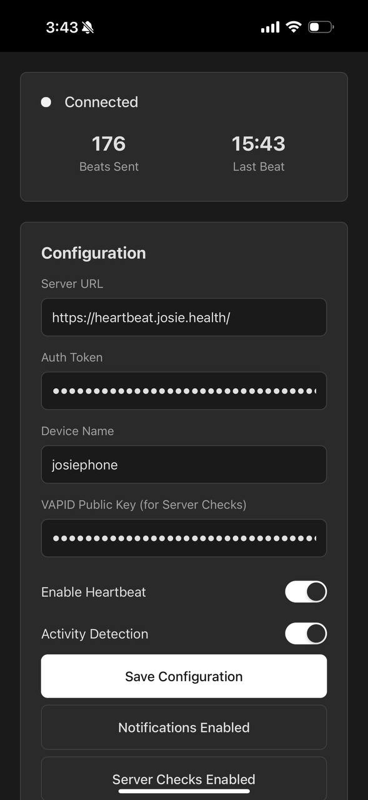

# heartbeat-pwa

This is the Progressive Web App (PWA) client for [Heartbeat](https://github.com/5HT2B/heartbeat). It will ping the central server every minute, as long as the device is actively being used (optional activity detection) and the app is enabled.

The PWA can be installed on mobile devices (iOS/Android) and desktop browsers.

# Jump to
- [Installation](#installation)
- [Configuration](#configuration)
- [Background Operation](#background-operation)
- [Deployment](#deployment)

## Installation

### Option 1: Visit the hosted version

1. Open your mobile browser and navigate to your hosted Heartbeat PWA URL (example: https://pwa.heartbeat.josie.health/)
2. For iOS: Tap the share button and select "Add to Home Screen"
3. For Android: Tap the menu and select "Install App" or "Add to Home Screen"
4. The app will install and appear on your home screen with an icon

### Option 2: Self-host the PWA

1. Clone or download the PWA files:
```bash
git clone https://github.com/pfeifferj/heartbeat-pwa.git
cd heartbeat-pwa
```

2. Serve the files using any web server:
```bash
# Using Python
python3 -m http.server 8000

# Using Node.js
npx serve .
```
## Configuration

1. Open the PWA in your browser or installed app
2. Enter your Heartbeat server configuration:
   - **Server URL**: Your Heartbeat server endpoint (e.g., `https://your.heartbeat.domain`)
   - **Auth Token**: Your authentication token from the Heartbeat server
   - **Device Name**: A friendly name for this device (e.g., "iPhone", "Android Tablet")



3. Toggle options:
   - **Enable Heartbeat**: Start/stop sending heartbeats
   - **Activity Detection**: Only send heartbeats when device is actively used (within 2 minutes)
   - **Enable Notifications**: Allow notifications for connection status changes

4. Click "Save Configuration" to persist your settings

## Background Operation

### Server-Initiated Heartbeat Checks (Recommended)

The PWA supports **server-initiated heartbeat checks** via push notifications:

**How it works:**
1. PWA subscribes to push notifications when "Enable Server Checks" is clicked
2. Server can send push notifications to wake up the service worker at any time
3. Service worker automatically sends a heartbeat and shows a notification
4. Works even when PWA is completely closed on the device

**Setup Requirements:**
1. Server must have VAPID keys configured (see [Server Setup](#server-setup-for-push-notifications) below)
2. Enable notifications in PWA settings
3. Click "Enable Server Checks" button
4. Server admin can trigger checks via API or scheduled checkins

### Traditional Background Sync (Limited)

Without server-initiated checks, background operation is limited:

#### Android (Chrome/Edge)
- **When installed as PWA**: Limited background execution with Periodic Background Sync
- **Minimum interval**: 12 hours when app is closed (browser limitation)
- **Best practice**: Keep app open but minimized for continuous heartbeats

#### iOS (Safari)
- **No background execution** when PWA is closed
- **Must keep app open** (can be minimized) for heartbeats to continue
- **Alternative**: Use Shortcuts app to periodically open the PWA

#### Desktop Browsers
- Background sync works when browser is running
- Service worker remains active for offline queuing
- Best results with PWA installed as desktop app

## Server Setup for Push Notifications

To enable server-initiated heartbeat checks, the main heartbeat server needs to be configured with VAPID keys and the new push notification endpoints.

### Prerequisites

The main heartbeat server must be updated with the push notification functionality.

### 1. Generate VAPID Keys

```bash
# Install web-push CLI tool
npm install -g web-push

# Generate VAPID keys
web-push generate-vapid-keys

# Output will look like:
# Public Key: BEl62iUYgUivxIkv69yViEuiBIa-Ib9-SkvMeAtA3LFgDzkrxZJjSgSnfckjBJuBkr3qBUYIHBQFLXYp5Nksh8U
# Private Key: tUkzMcPbtl2-xZ4Z5A1OqiELPo2Pc9-SFNw6hU8_Hh0
```

### 2. Configure Server Environment

Add to your heartbeat server's `.env` file:

```bash
# VAPID Configuration for Push Notifications
VAPID_PUBLIC_KEY=BEl62iUYgUivxIkv69yViEuiBIa-Ib9-SkvMeAtA3LFgDzkrxZJjSgSnfckjBJuBkr3qBUYIHBQFLXYp5Nksh8U
VAPID_PRIVATE_KEY=tUkzMcPbtl2-xZ4Z5A1OqiELPo2Pc9-SFNw6hU8_Hh0
VAPID_SUBJECT=mailto:your-email@example.com
```

### 3. Configure PWA

The PWA now supports configuring the VAPID public key directly through the user interface - no code changes needed:

1. Open the PWA configuration section
2. Enter your VAPID public key in the "VAPID Public Key (for Server Checks)" field
3. Save your configuration
4. Click "Enable Server Checks" to subscribe to push notifications

Example VAPID public key format:
```
BEl62iUYgUivxIkv69yViEuiBIa-Ib9-SkvMeAtA3LFgDzkrxZJjSgSnfckjBJuBkr3qBUYIHBQFLXYp5Nksh8U
```
